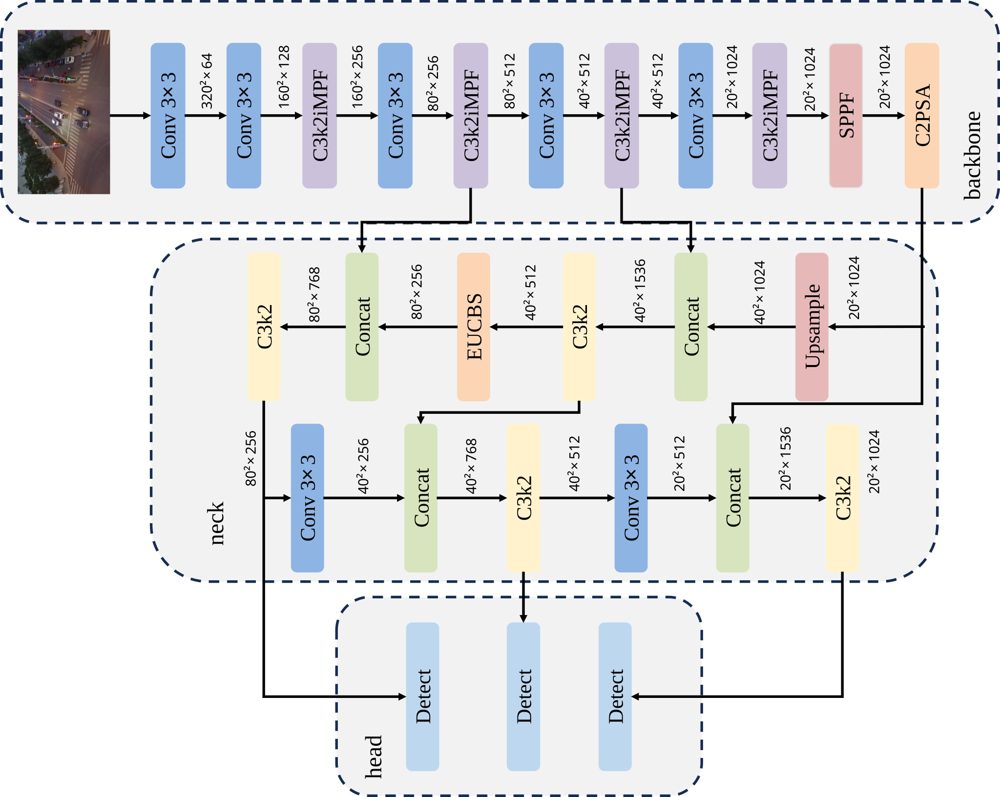
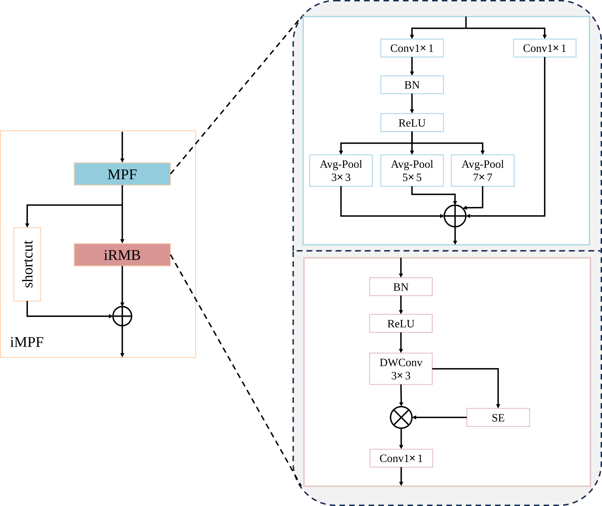
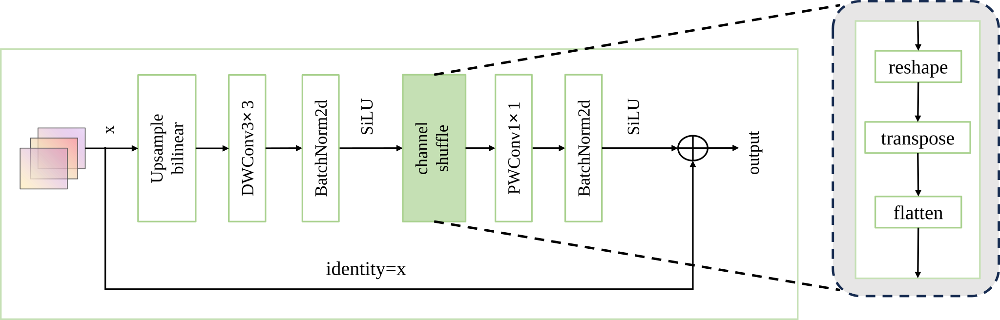
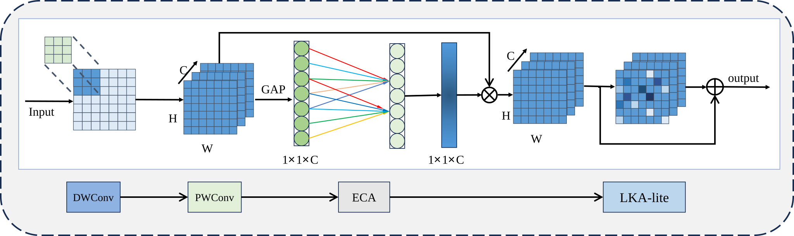

# YOLO-SEE: Small-object Enhancement and Efficiency for UAV Aerial Image Object Detection

> **Abstract:** This project presents **YOLO-SEE**, an enhanced deep learning framework specifically designed to address the critical challenges of UAV aerial image object detection, such as low detection performance, severe occlusion, and high model complexity.

---

## 1. Overview

In the field of **Unmanned Aerial Vehicle (UAV)** imagery, achieving high detection performance remains a formidable challenge. The disproportionately small pixel footprint of targets often forces a compromise between recognition accuracy and model efficiency. 

**YOLO-SEE** bridges this gap by optimizing small-object detection without sacrificing real-time performance on resource-constrained edge devices.


## 2. Setup

### Prerequisites
* **Python**: $\ge$ 3.8
* **CUDA**: 12.x (Tested on CUDA 12.4)
* **PyTorch**: $2.5.1$(https://pytorch.org/)

### Step-by-Step Setup
We recommend using **Conda** to manage your environment:

```bash
conda create -n YOLO_SEE python=3.11 -y
conda activate YOLO_SEE 

pip install torch==2.5.1+cu124 torchvision==0.20.1+cu124 torchaudio==2.5.1+cu124 --extra-index-url https://download.pytorch.org/whl/cu124

pip install -r requirements.txt
```
## 3. Dataset Preparation
### 1. Dataset Acquisition
**VisDrone**: The VisDrone2019-DET dataset is available in Kaggle at  (https://www.kaggle.com/datasets/banuprasadb/visdrone-dataset) or via the official project page at (http://aiskyeye.com/).

**TinyPerson**: The TinyPerson dataset is available in the OpenDataLab at (https://opendatalab.com/OpenDataLab/TinyPerson) and the official repository at (https://github.com/w-sugar/TinyBenchmark).

**HIT-UAV**: A High-altitude Infrared Thermal Dataset is available in Kaggle at (https://www.kaggle.com/datasets/pandrii000/hituav-a-highaltitude-infrared-thermal-dataset) or via GitHub at (https://github.com/suojiashun/HIT-UAV-Infrared-Thermal-Dataset).

### 2.Dataset Configuration File
The project includes pre-configured `.yaml` files for three major UAV datasets. You need to update the `path` in these files to point to your local data:

* **VisDrone**: Edit VisDrone2019_DET.yaml

* **TinyPerson**: Edit TinyPerson.yaml

* **HIT-UAV**: Edit HIT-UAV.yaml

### 3.Recommended Directory Structure

To ensure the training script correctly maps images to labels, please organize your dataset according to the following structure:

```text
/your/local/path/dataset_name/
├── images/
│   ├── train/          # Training images
│   └── val/            # Validation images
└── labels/
    ├── train/          # Training labels
    └── val/            # Validation labels
```
## 4. Train and Predict
Use the `train.py` script to start training. You should specify the `yolosee.yaml` architecture file which incorporates the custom modules.
```bash
python train.py \
--model yolosee.yaml \
--data VisDrone2019_DET.yaml \
--batch 16 \
--epochs 300 \
--img 640
```
To run detection on new images, use the `predict.py` script with your trained weights (e.g., `best.pt`):
```bash
python predict.py \
--model path/to/best.pt \
--source data/images/test.jpg \
--conf 0.2
```
## 5. Key Features

* **Ultra-Lightweight**: Only **2.3M** parameters—perfect for embedded deployment.
* **High Real-time Efficiency**: Achieves a detection speed of **227 FPS** (on VisDrone2019).
* **Small-Object Enhanced**: Custom-designed modules to capture features of tiny and occluded targets.
* **Edge-Ready**: Low computational cost (**6.5G FLOPs**) tailored for NVIDIA Jetson and other edge platforms.

## 6. Core Contributions

The framework introduces four major technical innovations:

1.  **C3k2iMPF (Backbone)**: Integrates the *Inverted Residual Mobile Block (iRMB)* with a *Multi-scale Pooling Fusion (MPF)* mechanism. It strengthens small-object feature extraction while drastically reducing complexity.

2.  **SEUCB (Neck)**: The *Small Efficient Up-Convolution Block* optimizes the upsampling process, enabling efficient multi-scale feature representation and transmission.

3.  **ELConv (Convolution)**: An *Enhanced Lightweight Convolution* module tailored for small objects, balancing precision with real-time processing requirements.

4.  **Multi-Dataset Validation**: Extensive evaluation on three challenging datasets: **VisDrone2019**, **TinyPerson**, and **HIT-UAV**.

## 7. Performance

| Dataset | mAP50 | Precision | Params | FLOPs | Speed |
| :--- | :---: | :---: | :---: | :---: | :---: |
| **VisDrone2019** | **34.6%** | 45.1% | 2.3M | 6.5G | **227 FPS** |
| **TinyPerson** | **15.9%** | 36.1% | 2.302M | 6.5G | - |
| **HIT-UAV** | **81.5%** | 89.6% | 2.3M | 6.5G | - |

## 8. The paper
If you find this code or method useful for your research, please cite the following paper:

```bash
@software{Jocher_Ultralytics_YOLO_2023,
author = {Jocher, Glenn and Qiu, Jing and Chaurasia, Ayush},
license = {AGPL-3.0},
month = jan,
title = {{Ultralytics YOLO}},
url = {https://github.com/ultralytics/ultralytics},
version = {8.0.0},
year = {2023}
}

@misc{zhang2023rethinkingmobileblockefficient,
      title={Rethinking Mobile Block for Efficient Attention-based Models}, 
      author={Jiangning Zhang and Xiangtai Li and Jian Li and Liang Liu and Zhucun Xue and Boshen Zhang and Zhengkai Jiang and Tianxin Huang and Yabiao Wang and Chengjie Wang},
      year={2023},
      eprint={2301.01146},
      archivePrefix={arXiv},
      primaryClass={cs.CV},
      url={https://arxiv.org/abs/2301.01146}, 
}

@misc{rahman2024emcadefficientmultiscaleconvolutional,
      title={EMCAD: Efficient Multi-scale Convolutional Attention Decoding for Medical Image Segmentation}, 
      author={Md Mostafijur Rahman and Mustafa Munir and Radu Marculescu},
      year={2024},
      eprint={2405.06880},
      archivePrefix={arXiv},
      primaryClass={eess.IV},
      url={https://arxiv.org/abs/2405.06880}, 
}
```